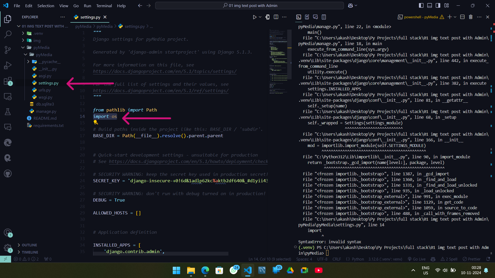
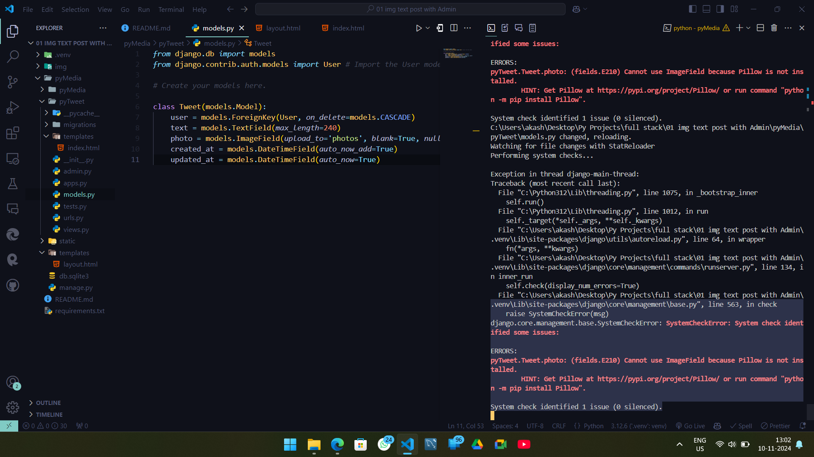

```yaml
Py Projects
│
│── Python Projects
│── Django Projects
│     │
│     │── Twitter: (under Devlopment)
│     └── ...
└── ...    
```

| [notes](https://github.com/akashdip2001/ML-Machine-Learning/blob/main/py/README.md) | [Python Projects](https://github.com/akashdip2001/Python-Projects) | [Django Projects](https://github.com/akashdip2001/pyTweet) |
| --- | --- | --- |


[docs](https://docs.chaicode.com/getting-started-with-django/)

```python
python -m venv .venv
.venv\Scripts\activate

pip install django
pip freeze > requirements.txt
pip install -r requirements.txt
python.exe -m pip install --upgrade pip

django-admin startproject <Project Name: pyMedia>
cd pyMedia

python manage.py runserver
# remove the Red error
python manage.py makemigrations
python manage.py migrate
```


```python
python manage.py runserver
```


### Create Superuser

```python
python manage.py createsuperuser
# Username (leave blank to use 'akash'): akashdip2001
# Email address: akashdip.art@gmail.com
# Password:M@...
# Password (again):M@...
python manage.py runserver
```


```yaml
C:\Users\akash\Desktop\Py Projects\full stack\01 img text post with Admin\
│
├── .venv/                      # Your virtual environment directory
│
├── pyMedia/                    # Project root directory
│   ├── manage.py               # Django's command-line utility for administrative tasks
│   ├── pyMedia/                # Django project folder (contains settings)
│   │   ├── __init__.py         # Indicates that this is a Python package
│   │   ├── asgi.py             # ASGI configuration
│   │   ├── settings.py         # Main settings/configuration file for the Django project
│   │   ├── urls.py             # URL routing for the project
│   │   ├── wsgi.py             # WSGI configuration
│   │   └── __pycache__/        # Cached bytecode for Python files
│   │
│   ├── app_name/               # Example Django app folder (optional)
│   │   ├── migrations/         # Database migrations for the app
│   │   ├── __init__.py
│   │   ├── admin.py            # Admin configuration
│   │   ├── apps.py             # App configuration
│   │   ├── models.py           # Database models
│   │   ├── tests.py            # Tests for the app
│   │   ├── views.py            # View functions
│   │   └── __pycache__/
│
├── requirements.txt            # List of packages to install with pip
└── db.sqlite3                   # Default SQLite database file (generated after migrations)
```



```python
import os
```

[docs](https://docs.chaicode.com/django-models/#defining-a-model)

```python
# at last of all
MEDIA_URL = '/media/'
MEDIA_ROOT = os.path.join(BASE_DIR, 'media')

STATIC_URL = '/static/'
STATICFILES_DIRS = [os.path.join(BASE_DIR, 'static')]
```


```python
from django.conf import settings
from django.conf.urls.static import static

urlpatterns = [
    path('admin/', admin.site.urls),
    #...
    #...
] + static(settings.MEDIA_URL, document_root=settings.MEDIA_ROOT)
```

---

# Project set ✅ Now Create a app 🛩️

[docs](https://docs.chaicode.com/jinja-templates-app-in-django/#apps-in-django)

```python
python manage.py startapp <app Name: pyTweet>
```

###### create a urls.py file in this <app name> diractry.

###### and go to views.py & create a view to test the application is Run. view -> template -> inject.

#### app -> views.py

```python
from django.contrib import render

def index(request):
    return render(request, 'index.html')
```

#### app -> urls.py

```python
from django.urls import path
from . import views

urlpatterns = [
    path('', views.index, name='index'),
]
```

#### main (project) -> settings.py -> ask main we create a new app

```python
# Application definition

INSTALLED_APPS = [
    #'django.contrib.admin',
    #'django.contrib.auth',
    #'django.contrib.contenttypes',
    #'django.contrib.sessions',
    #'django.contrib.messages',
    #'django.contrib.staticfiles',
    'pyTweet',
]

TEMPLATES = [
    {
        # 'BACKEND': 'django.template.backends.django.DjangoTemplates',
        'DIRS': [os.path.join(BASE_DIR, 'templates')],
        # 'APP_DIRS': True,
        # 'OPTIONS': {
        #     'context_processors': [
        #         'django.template.context_processors.debug',
        #         'django.template.context_processors.request',
        #         'django.contrib.auth.context_processors.auth',
        #         'django.contrib.messages.context_processors.messages',
        #     ],
        # },
    },
]
```

#### main (project) -> urls.py -> ask main we create a new app and take all urls from this place.

```python
#from django.contrib import admin
from django.urls import path, include
#

urlpatterns = #[
    #path('admin/', admin.site.urls),
    path('tweet/', include('pyTweet.urls')),
#] + static(settings.MEDIA_URL, document_root=settings.MEDIA_ROOT)
```

##### Then we create a index.html file in templates dir in app dir (pyTweet).

```yaml
pyTweet
│
├── templates
│    │
│    └── index.html
```

```html
<!DOCTYPE html>
<html lang="en">
  <head>
    <meta charset="UTF-8" />
    <meta name="viewport" content="width=device-width, initial-scale=1.0" />
    <title>Document</title>
    <style>
      body {
        background-color: #000;
        color: #fff;
      }
    </style>
  </head>
  <body>
    Test Akashdip 2001
  </body>
</html>
```

## In one short.

after tweet (project/url.py) control pass to --> Tweet app --> app/url.py --> then render the views, So go to app/views.py --> Then we pass a view named "index".

```python
python manage.py runserver
```


<!-- Layouts configured -> create models/ forms -> connect it with app. -->

### create a layout.html in templates dir. so that we use it in everywhere.

```yaml
.venu
pyMedia
│
├── templates
│    │
│    └── layout.html
```

```html

<!DOCTYPE html>
<html lang="en">
<head>
    <meta charset="UTF-8">
    <meta name="viewport" content="width=device-width, initial-scale=1.0">
    <title>
        
        pyMedia <!--if anyone can't app any Title, so it's the default -->
        
    </title>
</head>
<body>
    <div class="container">
        
        
</body>
</html>
```

[Bootstrap docs](https://getbootstrap.com/docs/5.3/getting-started/introduction/)

```html
<!DOCTYPE html>
<html lang="en">
  <head>
    <!-- <meta charset="UTF-8">
    <meta name="viewport" content="width=device-width, initial-scale=1.0"> -->
    <link
      href="https://cdn.jsdelivr.net/npm/bootstrap@5.3.3/dist/css/bootstrap.min.css"
      rel="stylesheet"
      integrity="sha384-QWTKZyjpPEjISv5WaRU9OFeRpok6YctnYmDr5pNlyT2bRjXh0JMhjY6hW+ALEwIH"
      crossorigin="anonymous"
    />
    <!-- <title>Document</title> -->
  </head>
  <body></body>
</html>
```

### Modify the app/ index.html

#### python 1st search project level layout, if not there then fond the layout in your app --> So, no need to give the complete patch, just "layout.html"

```html
  pyTweet  
<h1>Welcome to pyTweet Django project</h1>

```


### templates.layout.html

```html
<body class="bg-dark">
  <!-- <div class="container">
        
         -->
</body>
```

### app.index.html

```html
<h1 class="text-center text-white mt-4">Welcome to pyTweet</h1>
```


[copy Nav bar from Bootstrap](https://getbootstrap.com/docs/5.3/components/navbar/)

#### Because of it's a common Nav bar, for all pages... So we add it on templates/ layout.html

```html
</head>
<body class="bg-dark">
    <!-- Copy & Pest the Nav Bar -->
    <div class="container">
```

### No need Dark bg manually.


# Layout ✅


# Create models

### app (pyTweet) --> models.py

```python
from django.db import models
from django.contrib.auth.models import User # Import the User model to modify everything of user

# Create your models here.

class Tweet(models.Model):
    user = models.ForeignKey(User, on_delete=models.CASCADE)
    text = models.TextField(max_length=240)
    photo = models.ImageField(upload_to='photos', blank=True, null=True)
    created_at = models.DateTimeField(auto_now_add=True)
    updated_at = models.DateTimeField(auto_now=True)
```

# ⚠️ Error:



The error indicates that Django cannot use the `ImageField` in your model because the required `Pillow` library (used for image processing) is not installed.

### Solution

0. Optional

   ```powershell
   pip freeze > requirements.txt
   ```

   ```go
   asgiref==3.8.1
   Django==5.1.3
   pillow==11.0.0
   sqlparse==0.5.1
   tzdata==2024.2
   ```

1. **Install Pillow**:
   Activate your virtual environment (if it’s not already activated), and then install `Pillow` by running:

   ```powershell
   python -m pip install Pillow
   ```

2. **Verify Installation**:
   After installing, you can verify that `Pillow` is installed by running:

   ```powershell
   python -m pip show Pillow
   ```

3. **Run Migrations Again** (if necessary):
   Once `Pillow` is installed, re-run the migrations to ensure everything is set up properly:

   ```powershell
   python manage.py makemigrations
   ```

   ```powershell
   python manage.py migrate
   ```

4. **Restart the Development Server**:
   After completing these steps, restart the Django development server:

   ```powershell
   python manage.py runserver
   ```

## Then register this model in admin model.

### app/ admin.py


### Now create app/ **forms.py**


## models ✅

## forms ✅

## register tweets in admin ✅

## views ⬇️ - define funsanality

### after that --> works on **Jinja Templates**

# in Views

        index
        tweet list
        tweet create
        tweet edit
        tweet delete


## Now create the Template of every view

```yaml
app/ templates
        │
        ├── #index.html
        ├── tweet_list.html
        ├── tweet_form.html
        ├── tweet_confirm_delete.html
        │
```

### edit those html and must add urls in app/ urls.py

#### after complete ✅ tweet_list.html

```html
  pyTweet  
<h1 class="text-center mt-4">Welcome to pyTweet Django project</h1>

<a href="" class="btn btn-primary"
  >Create a new tweet</a
>
<div class="container row gap-3">
  
  <!--# for-loop through the tweets from view,py -> def tweet_list(request): tweets = -->
  <div class="card mt-3">
    
    <div class="card-body">
      <p class="card-title">{{tweet.user.username}}</p>
      <h3 class="card-text">{{tweet.text}}</h3>
      <a href="" class="btn btn-warning">Edit</a>
      <a href="" class="btn btn-danger"
        >Delete</a
      >
    </div>
  </div>
  
</div>


```


 
##### Now add some css from Bootstrap.
```html
<a href="" class="btn btn-primary mb-4">Create a new tweet</a>
<!-- <div class="container row gap-3">
     -->
    <div class="card mt-3" style="width: 28rem;">
```


#### update tweet_form.html --> create post


[Watch Video](img/22.mkv)
[Watch Video](img/23.mp4)

---

---


# Security

### Secure rutes

### add Registration -> Lig in

1. [Block Post create]()

## all files without Security

#### app/ views.py

```python
from django.shortcuts import render
from .models import Tweet
from .forms import TweetForm #Recheck --> app/ forms.py --> class TweetForm(forms.ModelForm):
from django.shortcuts import get_object_or_404, redirect # get_object_or_404 is used to get the object from the model or return 404 error

# Create your views here.

def index(request):
    return render(request, 'index.html')

def tweet_list(request):
    tweets = Tweet.objects.all().order_by('-created_at') # Get all the tweets from the database and order by created_at
    return render(request, 'tweet_list.html', {'tweets': tweets}) # Pass the tweets to the template

def tweet_create(request):
    if request.method == 'POST': # Check if the request method is POST
        form = TweetForm(request.POST, request.FILES) # Create a form with the request data
        if form.is_valid(): # Check if the form is valid
            tweet = form.save(commit=False) # Don't Save the form data to the database, just hold it in the variable
            tweet.user = request.user # Set the user of the tweet to the current user
            tweet.save() # Now Save the tweet to the database
            return redirect('tweet_list') # Redirect to the tweet list page
    else:
        form = TweetForm() # Create a new form
    return render(request, 'tweet_form.html', {'form': form}) # Pass the form to

def tweet_edit(request, tweet_id):
    tweet = get_object_or_404(Tweet, pk=tweet_id, user = request.user) # Get the tweet object from the database, user = request.user --> only login user can edit the tweet.
    if request.method == 'POST':
        form = TweetForm(request.POST, request.FILES, instance=tweet)
        if form.is_valid():
            tweet = form.save(commit=False)
            tweet.user = request.user
            tweet.save()
            return redirect('tweet_list')
    else:
        form = TweetForm(instance=tweet) # Create a form with the tweet data, instance=tweet is used to populate the form with the tweet data
    return render(request, 'tweet_form.html', {'form': form}) # Pass the form to


def tweet_delete(request, tweet_id):
    tweet = get_object_or_404(Tweet, pk=tweet_id, user = request.user) # Get the tweet object from the database, user = request.user --> only login user can delete the tweet.
    if request.method == 'POST':
        tweet.delete() # Delete the tweet
        return redirect('tweet_list')
    return render(request, 'tweet_confirm_delete.html', {'tweet': tweet}) # Pass the tweet to the template
```

### app/ urls.py

```python
from django.urls import path
from . import views

urlpatterns = [
    path('', views.tweet_list, name='tweet_list'),
    path('create/', views.tweet_create, name='tweet_create'),
    path('<int:tweet_id>/edit/', views.tweet_edit, name='tweet_edit'),
    path('<int:tweet_id>/delete/', views.tweet_delete, name='tweet_delete'),

]
```

### forms.py

```python
from django import forms
from .models import Tweet

class TweetForm(forms.ModelForm):
    class Meta:
        model = Tweet
        fields = ['text', 'photo']
```

### tweet_list.html

```html
  pyTweet  
<h1 class="text-center mt-4">Welcome to pyTweet Django project</h1>

<a href="" class="btn btn-primary mb-4"
  >Create a new tweet</a
>
<div class="container row gap-3">
  
  <!--# for-loop through the tweets from view,py -> def tweet_list(request): tweets = -->
  <div class="card mt-3" style="width: 24rem;">
    
    <div class="card-body">
      <p class="card-title">{{tweet.user.username}}</p>
      <h3 class="card-text">{{tweet.text}}</h3>
      <a href="" class="btn btn-warning">Edit</a>
      <a href="" class="btn btn-danger"
        >Delete</a
      >
    </div>
  </div>
  
</div>


```

### tweet_form.html

```html
  pyTweet  
<h1 class="text-center mt-4">Welcome to pyTweet Django project</h1>

<h2 class="text-left">
   Edit  Create 
</h2>

<form method="post" enctype="multipart/form-data" class="form">
  
  <!-- #for views.py -> def tweet_create(request): -> if form.is_valid(): # Check if the form is valid -->
  {{ form.as_p }}
  <button type="submit" class="btn btn-warning">Submit</button>
  <button type="reset" class="btn btn-danger">Reset</button>
  <!-- <button type="button" class="btn btn-primary" onclick="window.location.href=''">Cancel</button> -->
  <a href="" class="btn btn-primary">Cancel</a>
</form>

```

### tweet_confirm_delete.html

```html
  pyTweet  
<h2 class="text-center mt-4">If once Delete -> Never come back</h2>
<h1 class="text-center mt-4" style="color: rgb(252, 58, 58);">
  are you sure to Delete ?
</h1>

<!--see the post preview to delete-->
<div class="card mt-3 mx-auto" style="width: 24rem;">
  
  
  
  <div class="card-body text-center">
    <p class="card-title">{{ tweet.user.username }}</p>
    <h3 class="card-text">{{ tweet.text }}</h3>
  </div>
</div>

<form method="post">
  
  <div class="text-center mt-4">
    <button type="submit" class="btn btn-danger">Delete</button>
    <a href="" class="btn btn-success">Cancel</a>
  </div>
</form>


```

---

# Block Post create, edit & delete

```python
#from django.shortcuts import render
#from .models import Tweet
#from .forms import TweetForm
#from django.shortcuts import get_object_or_404, redirect
from django.contrib.auth.decorators import login_required

# Create your views here.

# def index(request):
#     return render(request, 'index.html')

# def tweet_list(request):

@login_required
def tweet_create(request):

@login_required
def tweet_edit(request, tweet_id):

@login_required
def tweet_delete(request, tweet_id):
```

### After this you cant edit any post in incognito (Private)

---

# Create user registration using Django forms --> app/ forms.py

#### forms.py

```python
# from django import forms
# from .models import Tweet
from django.contrib.auth.forms import UserCreationForm
from django.contrib.auth.models import User

# class TweetForm(forms.ModelForm):
#     class Meta:
#         model = Tweet
#         fields = ['text', 'photo']

class UserRegisterForm(UserCreationForm):
    email = forms.EmailField()

    class Meta:
        model = User
        fields = ('username', 'email', 'password1', 'password2')

```

### create a folder, for custom Login

```yaml
.venu
pyMedia
│
├── templates
│    │
│    ├── registration
│    │    ├── register: html
│    │    ├── login: html
│    │    └── logged_out: html
│    │
│    └── #layout.html
```

### update views.py

```python
#from django.shortcuts import render
#from .models import Tweet
from .forms import TweetForm, UserRegistrationForm
#from django.shortcuts import get_object_or_404, redirect
from django.contrib.auth.decorators import login_required
from django.contrib.auth import authenticate, login

## create views to user registration and login
def register(request):
    if request.method == 'POST':
        form = UserRegistrationForm(request.POST)
        if form.is_valid():
            # form.save() # Save the user to the database
            # return redirect('tweet_list') # Redirect to the tweet list page
            # or
            user = form.save(commit=False)
            user.set_password(form.cleaned_data['password1'])
            user.save()
            login(request, user)
            return redirect('tweet_list')
    else:
        form = UserRegistrationForm()

    return render(request, 'registration/register.html', {'form': form})
```

### update urls.py

```python
from django.urls import path
from . import views

urlpatterns = [
    #path('', views.tweet_list, name='tweet_list'),
    #path('create/', views.tweet_create, name='tweet_create'),
    #path('<int:tweet_id>/edit/', views.tweet_edit, name='tweet_edit'),
    #path('<int:tweet_id>/delete/', views.tweet_delete, name='tweet_delete'),
    path('register/', views.register, name='register'),

]
```


### python can't find the Login pg.

### we update it in project(pyMedia)/ settings.py

```python
# STATIC_URL = 'static/'

# DEFAULT_AUTO_FIELD = 'django.db.models.BigAutoField'

# MEDIA_URL = '/media/'
# MEDIA_ROOT = os.path.join(BASE_DIR, 'media')

# STATIC_URL = '/static/'
# STATICFILES_DIRS = [os.path.join(BASE_DIR, 'static')]

LOGIN_URL = '/accounts/login/'
LOGIN_REDIRECT_URL = '/pyTweet/'
LOGOUT_REDIRECT_URL = 'PYTweet/'
```

### project/ urls.py

```python
# from django.contrib import admin
# from django.urls import path, include
# from django.conf import settings
# from django.conf.urls.static import static
from django.contrib.auth import views as auth_views

# urlpatterns = [
    # path('admin/', admin.site.urls),
    # path('pyTweet/', include('pyTweet.urls')),
    path('accounts/', include('django.contrib.auth.urls')),

# ] + static(settings.MEDIA_URL, document_root=settings.MEDIA_ROOT)
```


# ⚠️ Error in Register pg.

### one user cant's edit other's post But see the edit button

### Hide the edit button with condition

#### tweet_liest.html

```html
<!-- <div class="container row gap-3">
    
    <div class="card mt-3" style="width: 24rem;">
        
        <div class="card-body">
            <p class="card-title">{{tweet.user.username}}</p>
            <h3 class="card-text">{{tweet.text}}</h3> -->

<!-- <a href="" class="btn btn-warning">Edit</a>
            <a href="" class="btn btn-danger">Delete</a> -->

<!-- </div>
    </div>
    
</div> -->
```

##### Registration pg not work -> this user 2 created by admin


# Logout


### you have to a Registered user , otherwise you can't see the Logout Button


# ⚠️ Logout Button not work
